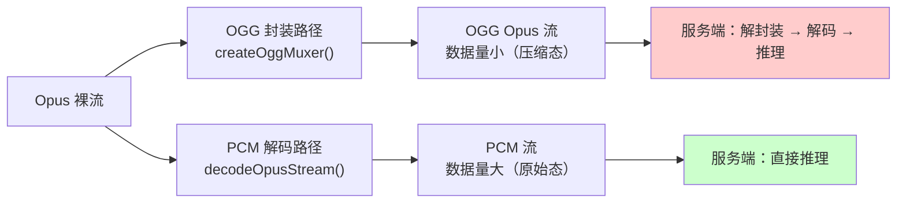

在使用 univoice 进行 ASR（语音识别）时，理解音频数据的处理路径有助于选择最优方案。

## 两种处理路径

当输入为 Opus 编码的音频数据时，univoice 提供**两种**处理路径：



### 路径 1：OGG Opus 封装

使用纯 JS 将 Opus 裸流封装为 OGG 容器格式：

```typescript
import { createOggMuxer, createASR } from 'univoice';

const asr = createASR({
  provider: 'doubao',
  format: 'ogg',
  codec: 'opus',
});

// 将 Opus 包封装为 OGG 格式
const audioStream = createOggMuxer(opusPackets, {
  sampleRate: 16000,
});

const result = await asr.listen(audioStream);
```

**特点**：
- 客户端操作极轻（纯 JS，添加 OGG 页头）
- 发送数据量小（Opus 压缩态）
- 服务端需要额外解封装 + 解码
- **总延迟较高**

### 路径 2：PCM 解码

使用 libopus C 库将 Opus 解码为 PCM 原始数据：

```typescript
import { decodeOpusStream, createASR } from 'univoice';

const asr = createASR({
  provider: 'doubao',
  format: 'pcm',
  codec: 'raw',
});

// 将 Opus 包解码为 PCM
const audioStream = decodeOpusStream(opusPackets, {
  sampleRate: 16000,
});

const result = await asr.listen(audioStream);
```

**特点**：
- 客户端使用 libopus C 库解码（极快，微秒级）
- 发送数据量大（PCM 展开后约为 Opus 的 6-10 倍）
- 服务端直接推理，无需额外解码
- **总延迟较低**

## 性能对比

实测数据（豆包 ASR，16kHz）：

| 指标 | OGG Opus 路径 | PCM 路径 |
|------|---------------|----------|
| **总耗时** | ~16613 ms | ~12135 ms |
| **差异** | 基准 | **快约 37%** |
| 客户端处理 | 极短（纯 JS OGG 封装） | 极短（libopus C 库解码） |
| 网络传输量 | 小（压缩态） | 大（6-10 倍） |
| 服务端操作 | 解封装 + 解码 + 推理 | 直接推理 |

### 核心原因

瓶颈在**服务端**而非客户端：

- OGG 路径的服务端需要额外做「解封装 OGG → 解码 Opus → 推理」三步
- PCM 路径的服务端只需「推理」一步
- 客户端的两条路径耗时都可忽略不计（微秒级 vs 毫秒级的总延迟）

## 选择建议

| 场景 | 推荐路径 | 原因 |
|------|----------|------|
| 对延迟敏感（实时对话） | **PCM 解码** | 总延迟更低 |
| 低带宽环境 | OGG 封装 | 传输数据量小 |
| 不想引入外部依赖 | OGG 封装 | 无需 prism-media |
| 服务端原生支持 OGG Opus | OGG 封装 | 减少服务端适配工作 |
| 通用场景 | **PCM 解码** | 兼容性最好，所有提供商均支持 |

<Callout type="warning">
当前只有**豆包（doubao）** ASR 提供商完整支持 OGG Opus 路径。其他提供商仅支持 PCM 或原始音频文件输入。
</Callout>

## 工具函数速查

| 函数 | 说明 | 来源 |
|------|------|------|
| `createOggMuxer(packets, options)` | OGG 封装器 | `univoice/asr` |
| `decodeOpusStream(packets, options)` | Opus 解码器 | `univoice/asr` |
| `bufferToAudioStream(buffer)` | Buffer 转 AudioStream | `univoice/asr` |

详见 [ASR 工具函数](/utils/asr-utils)。
