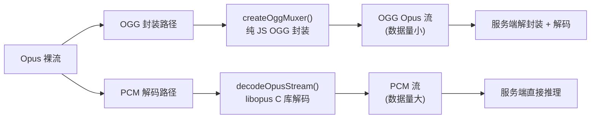
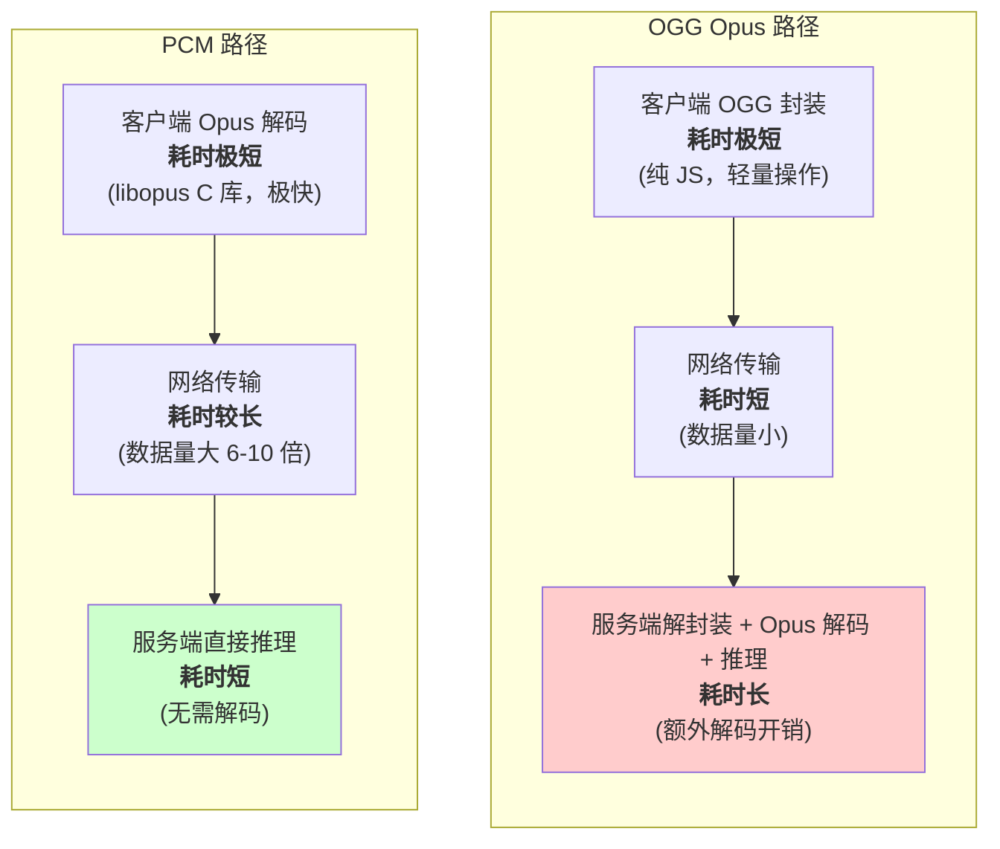

在使用 univoice SDK 进行 ASR（语音识别）时，Opus 音频数据有两种处理路径：**OGG 封装**和 **PCM 解码**。实测数据显示 OGG Opus 路径的总耗时比 PCM 路径慢约 37%，本文将详细分析原因。

## 两种音频处理路径

univoice SDK 提供了两种将 Opus 裸流输入到 ASR 服务的方式：



### 路径 1：OGG Opus 封装

```typescript
import { createOggMuxer } from 'univoice/asr';

// 将 Opus 裸流封装为 OGG 格式，直接发送给 ASR 服务
const audioStream = createOggMuxer(opusPackets, {
  sampleRate: 16000,
});
```

- **客户端操作**：纯 JS 实现 OGG 封装，无外部依赖
- **发送数据**：OGG Opus 格式，数据量小（压缩态）
- **服务端操作**：需要解封装 OGG → 解码 Opus → 推理

### 路径 2：PCM 解码

```typescript
import { decodeOpusStream } from 'univoice/asr';

// 将 Opus 裸流解码为 PCM，发送给 ASR 服务
const audioStream = decodeOpusStream(opusPackets, {
  sampleRate: 16000,
});
```

- **客户端操作**：通过 prism-media（libopus C 库）解码为 PCM
- **发送数据**：PCM 原始数据，数据量增大约 6-10 倍
- **服务端操作**：直接使用 PCM 推理，无需额外解码

## 性能对比数据

以下是使用豆包 ASR 服务进行流式语音识别的实测数据：

| 指标 | OGG Opus 路径 | PCM 路径 | 差异 |
|------|---------------|----------|------|
| **总耗时** | ~16613ms | ~12135ms | OGG 慢约 37% |
| **客户端处理** | 纯 JS OGG 封装 | libopus C 解码 | PCM 路径客户端略快 |
| **发送数据量** | 小（压缩态） | 大（PCM 展开后 6-10 倍） | OGG 数据量远小于 PCM |
| **服务端处理** | 解封装 + 解码 + 推理 | 直接推理 | PCM 路径服务端更快 |

<Callout type="info">
  以上数据基于实际业务场景的测试结果，具体数值因网络环境和 ASR 服务提供商而异，但趋势一致：PCM 路径的总延迟通常低于 OGG Opus 路径。
</Callout>

## 原因分析

### 核心原因：瓶颈在服务端，不在客户端

直觉上，"纯封装"（OGG 路径）应该比"解码"（PCM 路径）更快。但实际相反，原因是**整个链路的瓶颈在服务端处理能力，而非客户端**。



### 逐项分析

#### 1. 客户端处理：两条路径都很快

- **OGG 封装**：纯 JS 操作，只是添加 OGG 页面头部（每页约 27 字节头部），不涉及编解码计算，几乎不耗时
- **PCM 解码**：使用 libopus C 库（通过 prism-media），Opus 解码本身就极其高效，16kHz 单声道 20ms 帧的解码耗时在微秒级别

两条路径的客户端处理耗时差异可以忽略不计。

#### 2. 网络传输：OGG 数据量小，但差异不大

OGG Opus 是压缩格式，数据量远小于 PCM。但由于 ASR 流式传输的每个 chunk 本身不大，网络传输时间的差异对总延迟影响有限。

#### 3. 服务端处理：PCM 路径优势明显（关键差异）

这是两条路径性能差异的**主要原因**：

- **PCM 路径**：服务端收到的是原始 PCM 数据，可以直接进行推理，无需任何解码操作
- **OGG 路径**：服务端需要先解封装 OGG 容器，再解码 Opus 数据为 PCM，然后才能推理。这额外的解封装 + 解码步骤带来了显著的处理开销

#### 4. GZIP 压缩的无效开销

部分 ASR 服务会对传输的数据启用 GZIP 压缩。对于 OGG Opus 路径：
- Opus 本身已经是高度压缩的音频编码
- GZIP 对已压缩数据几乎无法进一步压缩，反而增加了压缩/解压缩的 CPU 开销
- 这进一步加大了 OGG 路径的服务端处理负担

#### 5. 发送粒度差异

两条路径的默认发送粒度不同：

| 参数 | OGG Opus 路径 | PCM 路径 |
|------|---------------|----------|
| **帧大小** | 60ms | 20ms |
| **每次发送** | 1 个 OGG page（含 1 个 Opus packet） | 3200 字节 PCM（100ms） |
| **发送间隔** | 每 60ms 一个 chunk | 每 100ms 一个 chunk |

OGG 路径每 60ms 发送一个 chunk，PCM 路径每 100ms 发送一个 chunk。更小的发送间隔意味着更频繁的网络交互和服务端处理。

## 使用建议

### 何时使用 PCM 解码路径（推荐）

- 对**延迟敏感**的场景（实时对话、语音助手）
- ASR 服务**不原生支持** OGG Opus 格式
- 网络带宽充足的环境

```typescript
import { createASR, decodeOpusStream } from 'univoice';

const asr = createASR({
  provider: 'doubao',
  audioFormat: { sampleRate: 16000 },
});

const audioStream = decodeOpusStream(opusPackets);
const result = await asr.listen(audioStream);
```

### 何时使用 OGG Opus 封装路径

- ASR 服务**原生支持** OGG Opus 输入（如豆包 SAUC 协议）
- **不想引入** prism-media 等外部依赖
- 客户端资源受限，希望将解码工作卸载到服务端
- 需要最小化网络传输数据量（低带宽环境）

```typescript
import { createASR, createOggMuxer } from 'univoice';

const asr = createASR({
  provider: 'doubao',
  format: 'ogg',
  codec: 'opus',
  audioFormat: { sampleRate: 16000 },
});

const audioStream = createOggMuxer(opusPackets);
const result = await asr.listen(audioStream);
```

<Callout type="warning">
  当前只有豆包（doubao）ASR 提供商完整支持 OGG Opus 路径。其他提供商（Qwen、OpenAI、Gemini、Minimax）仅支持 PCM 或原始音频文件输入。
</Callout>

## 总结

| | OGG Opus 路径 | PCM 路径 |
|---|---|---|
| **总延迟** | 较高 | 较低 |
| **客户端负担** | 极轻（纯 JS） | 轻（C 库解码） |
| **服务端负担** | 较重（解封装 + 解码） | 轻（直接推理） |
| **网络传输量** | 小 | 大（6-10 倍） |
| **外部依赖** | 无 | prism-media |
| **支持范围** | 仅豆包 | 所有提供商 |

选择哪条路径取决于你的具体场景。在大多数对延迟敏感的应用中，**PCM 解码路径是更好的选择**——客户端的 libopus C 库解码极快，而服务端节省下来的解码开销能显著降低总延迟。
