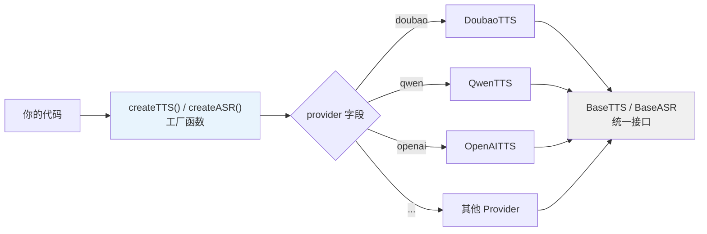
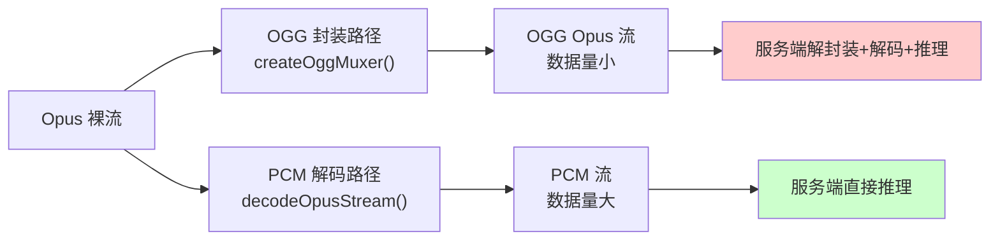

在使用 univoice SDK 之前，了解以下核心概念有助于更好地理解其设计。

## Provider 架构

univoice 采用**工厂模式 + 插件注册**架构，通过统一的接口调用不同的语音服务提供商。



### 工厂函数

`createTTS()` 和 `createASR()` 是创建实例的**推荐方式**：

```typescript
import 'univoice/tts/providers';
import { createTTS } from 'univoice';

const tts = createTTS({
  provider: 'doubao',  // 决定使用哪个提供商
  appId: '...',
  voice: 'zh_female_tianmeixiaoyuan_moon_bigtts',
});
```

TypeScript 会根据 `provider` 字段自动推断类型，提供对应的配置项提示。

### 插件注册

通过 `registerTTSProvider()` / `registerASRProvider()` 可以注册自定义提供商：

```typescript
import { createTTS, registerTTSProvider } from 'univoice/tts';
import { MyCustomTTS } from './my-custom-tts';

registerTTSProvider('my-provider', MyCustomTTS);

const tts = createTTS({ provider: 'my-provider', ... });
```

详见 [自定义 Provider 注册](/advanced/custom-provider)。

### 三种实例化方式对比

| 方式 | 代码 | 打包体积 | 适用场景 |
|------|------|----------|----------|
| 自动注册全部 | `import 'univoice/tts/providers'` | 较大（包含所有 provider） | 需要多提供商切换 |
| 手动注册单个 | `registerTTSProvider('doubao', DoubaoTTS)` | 最小（仅打包需要的） | 生产环境，优化体积 |
| 直接使用类 | `new DoubaoTTS({...})` | 最小 | 不需要工厂函数 |

## 流式 vs 非流式

### TTS 模式

| 模式 | 方法 | 返回值 | 说明 |
|------|------|--------|------|
| **非流式** | `synthesize({ text })` | `Promise<TTSResponse>` | 一次性返回完整音频 |
| **流式** | `speak(input, { stream: true })` | `AsyncIterable<TTSStreamChunk>` | 边合成边返回音频块 |

```typescript
// 非流式：等待完整音频返回
const response = await tts.synthesize({ text: '一段较长的文本' });
// response.audio -> 完整音频数据

// 流式：逐块接收音频
for await (const { audioChunk } of tts.speak('一段较长的文本', { stream: true })) {
  // 每个 audioChunk 是一个音频片段，可实时播放或保存
}
```

### ASR 模式

| 模式 | 方法 | 返回值 | 说明 |
|------|------|--------|------|
| **非流式** | `listen(audio)` | `Promise<ASRResponse>` | 返回完整识别结果 |
| **流式** | `listen(audio, { stream: true })` | `AsyncIterable<ASRStreamChunk>` | 实时返回识别中间结果 |

```typescript
// 非流式：等待完整识别结果
const result = await asr.listen(audioFile);
console.log(result.text); // 完整文本

// 流式：实时获取识别进度
for await (const chunk of asr.listen(audioFile, { stream: true })) {
  console.log(chunk.text);      // 当前识别文本（可能变化）
  console.log(chunk.isFinal);   // 是否为最终确认结果
}
```

### 何时选择哪种模式？

| 场景 | 推荐模式 | 原因 |
|------|----------|------|
| 已知完整文本，批量生成音频 | TTS 非流式 | 简单直接，无需处理流 |
| LLM 回复实时转语音 | TTS 流式 | 边生成边播放，降低首字延迟 |
| 音频文件转文字 | ASR 非流式 | 一次性得到完整结果 |
| 实时麦克风输入识别 | ASR 流式 | 实时显示识别过程 |

## TextStream 类型

`speak` 方法的输入参数 `TextStream` 支持三种类型：

```typescript
type TextStream =
  | string                              // 普通字符串
  | AsyncIterable<string>                // 异步文本流（Generator）
  | OpenAIStream;                        // OpenAI SDK 流式输出
```

### 三种输入方式示例

```typescript
// 1. 字符串输入
await tts.speak('你好世界', { stream: true });

// 2. AsyncIterable 文本流（模拟 LLM 逐步输出）
async function* mockLLMStream() {
  yield '今天天气';
  yield '非常不错，';
  yield '适合出去走走。';
}
await tts.speak(mockLLMStream(), { stream: true });

// 3. OpenAI Stream 直接传入（核心特性）
import OpenAI from 'openai';
const openai = new OpenAI({ apiKey: '...' });
const stream = await openai.chat.completions.stream({
  model: 'gpt-4o-mini',
  messages: [{ role: 'user', content: '讲个故事' }],
  stream: true,
});
await tts.speak(stream, { stream: true }); // 无需手动收集文本！
```

## 音频格式体系

### 容器格式

| 格式 | 说明 | 典型用途 |
|------|------|----------|
| `mp3` | 有损压缩，兼容性最好 | 通用场景，文件分享 |
| `wav` | 无压缩，质量高 | 专业音频处理 |
| `ogg` | 开源容器，通常配合 Opus 编码 | Web 端播放 |
| `flac` | 无损压缩 | 高保真存档 |
| `pcm` | 原始脉冲编码，无头信息 | 流式传输、实时处理 |
| `opus` | 高效语音编码（裸流） | 低带宽实时通信 |
| `ogg_opus` | OGG 容器封装 Opus 数据 | ASR 输入 |

### ASR 的两条音频处理路径

在 ASR 场景中，Opus 音频数据有两条处理路径：



- **OGG Opus 路径**：客户端轻量（纯 JS），但服务端需额外解码，总延迟较高
- **PCM 解码路径**：客户端需 libopus 解码（极快），服务端直接推理，总延迟更低

详见 [音频格式性能分析](/audio-format-performance)。

## 连接管理

部分提供商支持通过 `connect()` 方法预建立连接，实现连接复用：

```typescript
// 预建立 WebSocket 连接
const conn = await tts.connect();

// 复用连接进行多次合成（减少握手开销）
const response1 = await conn.speak('第一段文本');
const response2 = await conn.speak('第二段文本');

// 关闭连接
conn.close();
```

<Callout type="info">
并非所有提供商都支持 `connect()`。目前豆包、通义千问等基于 WebSocket 的提供商支持此功能。不支持的提供商调用时会抛出错误。
</Callout>

详见 [连接管理](/advanced/connection)。
