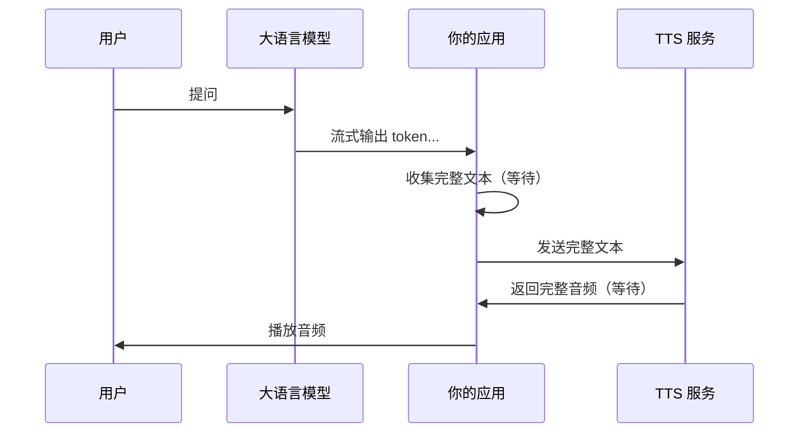
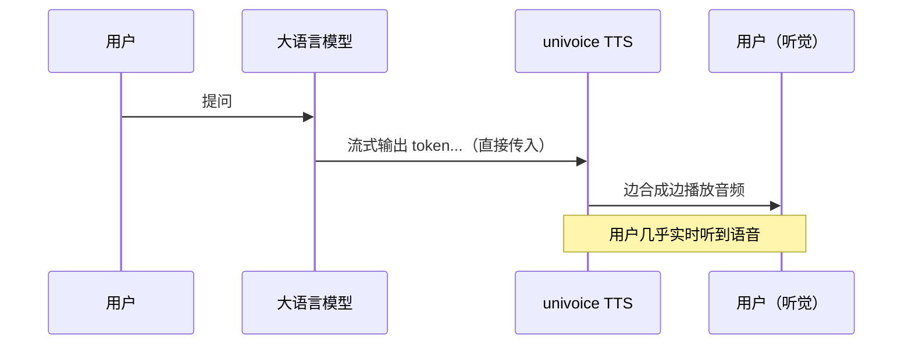

这是 univoice 的**核心差异化能力**：将大语言模型（如 OpenAI GPT）的流式输出**直接**转换为语音，实现「**边说边听**」，显著降低用户感知延迟。

## 为什么需要这个能力？

传统方案的流程：



用户需要等待 **LLM 生成完毕 + TTS 合成完毕** 才能听到声音。

univoice 的方案：



LLM 每输出一段文本，TTS 就立即开始合成对应的音频——两条流水线**并行执行**。

## 完整示例

### 环境准备

```bash
pnpm add univoice openai
```

### 代码实现

```typescript
import OpenAI from 'openai';
import 'univoice/tts/providers';
import { createTTS, saveAudio } from 'univoice';

// 1. 创建 OpenAI 客户端
const openai = new OpenAI({ apiKey: process.env.OPENAI_API_KEY });

// 2. 创建 TTS 实例（使用支持流式输出的提供商）
const tts = createTTS({
  provider: 'doubao',
  appId: process.env.DOUBAO_APP_ID,
  accessToken: process.env.DOUBAO_ACCESS_TOKEN,
  voice: 'zh_female_tianmeixiaoyuan_moon_bigtts',
  format: 'pcm',
  sampleRate: 24000,
});

// 3. 创建 OpenAI 流式请求
const openaiStream = await openai.chat.completions.stream({
  model: 'gpt-4o-mini',
  messages: [{ role: 'user', content: '用三句话介绍 TypeScript' }],
  stream: true,
});

// 4. 将 OpenAI stream 直接传入 TTS speak
console.log('开始合成...');
const chunks: Uint8Array[] = [];

for await (const { audioChunk } of tts.speak(openaiStream, { stream: true })) {
  chunks.push(audioChunk);
  // 这里可以实时将 audioChunk 发送给前端播放
  // 或写入音频设备进行实时播放
}

// 5. 保存完整音频（可选）
const buffer = Buffer.concat(chunks.map((c) => Buffer.from(c)));
require('node:fs').writeFileSync('output.pcm', buffer);
console.log(`合成完成，共 ${chunks.length} 个音频块，${buffer.length} bytes`);
```

## 关键点解析

### OpenAI Stream 如何被 TTS 消费？

univoice 内部会自动从 OpenAI 的 `Stream<ChatCompletionChunk>` 中提取文本内容，将其标准化为 `AsyncIterable<string>` 后送入 TTS 引擎。你**无需手动收集** LLM 输出的文本。

### 支持此功能的提供商

不是所有 TTS 提供商都支持流式输入：

| 提供商 | 流式输入支持 | 说明 |
|--------|-------------|------|
| 豆包 (`doubao`) | ✅ | 双向流式 WebSocket，原生支持 |
| 通义千问 (`qwen`) | ✅ | CosyVoice 流式合成 |
| 通义千问 Realtime (`qwen-realtime`) | ✅ | 实时交互模式 |
| MiniMax (`minimax`) | ✅ | WebSocket 协议 |
| 科大讯飞 (`xfyun`) | ✅ | 超拟人双向流式 |
| OpenAI (`openai`) | ❌ | 仅支持非流式 API |
| Gemini (`gemini`) | ❌ | 仅支持非流式 API |
| 智谱 GLM (`glm`) | ⚠️ | 伪流式（先收集再合成） |

<Callout type="warning">
使用不支持流式输入的提供商时，`speak(openaiStream, { stream: true })` 会退化为：先收集完所有文本，再一次性合成。此时不会获得「边发边收」的延迟优势。
</Callout>

## 性能优化建议

### 1. 选择合适的模型

不同 TTS 模型的首包延迟差异很大：

| 提供商 | 模型 | 首包延迟（约） |
|--------|------|---------------|
| MiniMax | speech-01-turbo | ~200ms（最快） |
| 豆包 | seed-tts-2.0 | ~500ms |
| 通义千问 | cosyvoice-v3-flash | ~550ms |
| 科大讯飞 | super-human-tts | ~550ms |

> 以上为参考值，实际以测试环境为准。详见 [音频格式性能分析](/audio-format-performance)。

### 2. 使用 PCM 格式

流式场景推荐使用 `pcm` 格式，避免 MP3 等需要完整帧才能解码的格式：

```typescript
const tts = createTTS({
  provider: 'doubao',
  format: 'pcm',       // 流式推荐
  sampleRate: 24000,
});
```

### 3. 实时播放

如果需要在合成的同时实时播放，可以使用 `playAudio` 或 `teeAudio`：

```typescript
import { teeAudio } from 'univoice';

// 同时保存和播放
await teeAudio(
  'output.pcm',
  tts.speak(openaiStream, { stream: true })
);
```

## 更多示例

<Callout type="info">
完整示例代码请参见 [`examples/tts/advanced/llm-to-tts.ts`](https://github.com/shenjingnan/univoice/blob/main/examples/tts/advanced/llm-to-tts.ts)
</Callout>
